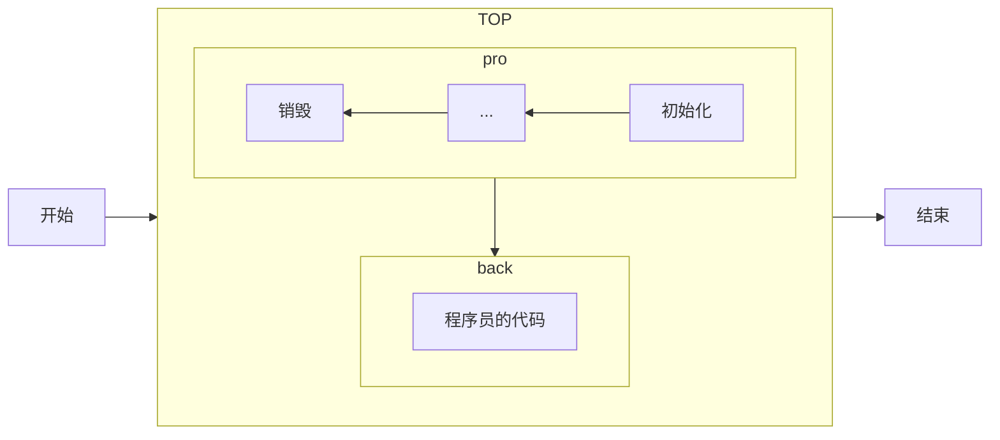

## ApplicationContextInitializer

  SpringBoot框架在设计之初,为了有更好的兼容性,在不同的运行阶段,提供了非常多的扩展点, 可以让程序员根据自己的需求, 在整个Spring应用程序运行过程中执行程序员自定义的代码




	IOC容器对象创建完成之后执行，可以对上下文环境做一些操作，例如运行环境属性注册等 
```	
使用
	1. 自定义类，实现ApplicationContextInitializer
	2. 在META-INF/spring.factories配置文件中配置自定义的类
```

```java
public class MyApplicationContextInitializer implements ApplicationContextInitializer {
    // ioc容器对象创建完毕后执行
    @Override
    public void initialize(ConfigurableApplicationContext applicationContext) {
        // 给上下文context对象注入环境属性
        // 1. 准备属性
        HashMap<String, Object> myMap = new HashMap<>();
        myMap.put("applicationName", "big-event");

        // 2. 获取一个属性资源管理对象
        // 获取的环境对象
        ConfigurableEnvironment environment = applicationContext.getEnvironment();
        // 属性资源管理对象
        MutablePropertySources propertySources = environment.getPropertySources();

        // 3. 注册
        propertySources.addLast(new MapPropertySource("myMap", myMap));
    }
}
```

这是一个Spring框架中的ApplicationContextInitializer实现类，用于在IoC容器对象创建完成后执行一些初始化操作。下面是对这段代码的详细解释：

1. `MyApplicationContextInitializer` 类声明了实现 `ApplicationContextInitializer` 接口，表明这是一个用于初始化应用上下文的类。

2. `initialize` 方法是接口中定义的方法，该方法在IoC容器对象创建完毕后被调用。在这个方法中，你可以执行一些自定义的初始化逻辑。

3. 在 `initialize` 方法中，首先准备了一个 `HashMap` 对象 `myMap`，用于存储自定义的属性。这里设置了一个属性 "applicationName" 的值为 "big-event"。

4. 获取应用上下文的环境对象 `ConfigurableEnvironment`，该对象允许你与应用程序的环境属性进行交互。

5. 从环境对象中获取属性资源管理对象 `MutablePropertySources`，它允许你管理属性源。

6. 使用 `propertySources.addLast` 方法向属性资源管理对象中注册一个自定义的属性源。这里创建了一个名为 "myMap" 的属性源，其内容是之前准备的 `myMap` 对象。

总体来说，这个初始化器的主要作用是在Spring IoC容器创建完成后，向应用上下文中注入一个自定义的环境属性，即 "applicationName" 设置为 "big-event"。这样在应用程序中就可以通过Spring的 `Environment` 对象获取到这个自定义属性。