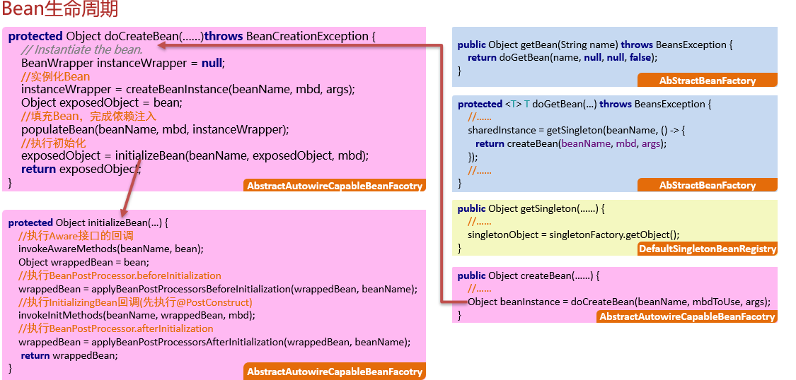

## Bean生命周期

AbstractAutowireCapableBeanFacotry.doCreateBean()
- 创建对象
  - 实例化（构造方法）
  - 依赖注入
- 初始化
  - 执行Aware接口回调
  - 执行BeanPostProcessor. postProcessBeforeInitialization
  - 执行InitializingBean回调（先执行@PostConstruct）
  - 执行BeanPostProcessor. postProcessAfterInitialization

- 使用对象
- 销毁对象
  - 执行DisposableBean回调(先执行@PreDestory)

问：请聊一聊Spring中Bean的生命周期? 

总: Bean的生命周期总的来说有4个阶段，分别有创建对象，初始化对象，使用对象以及销毁对象，而且这些工作大部分是交给Bean工厂的doCreateBean方法完成的
分：
         首先，在创建对象阶段，先调用构造方法实例化对象，对象有了后会填充该对象的内容，其实就是处理依赖注入
         其次，对象创建完毕后，需要做一些初始化的操作，在这里涉及到几个扩展点。
	1. 执行Aware感知接口的回调方法
	2.执行Bean后置处理器的postProcessBeforeInitialization方法
	3.执行InitializingBean接口的回调，在这一步如果Bean中有标注了@PostConstruct注解的方法，会先执行它
	4.执行Bean后置处理器的postProcessAfterInitialization
	把这些扩展点都执行完，Bean的初始化就完成了
         接下来，在使用阶段就是程序员从容器中获取该Bean使用即可
         最后，在容器销毁之前，会先销毁对象，此时会执行DisposableBean接口的回调，这一步如果Bean中有标注了@PreDestroy接口的函数，会先执行它	
总：简单总结一下，Bean的生命周期共包含四个阶段，其中初始化对象和销毁对象我们程序员可以通过一些扩展点执行自己的代码
