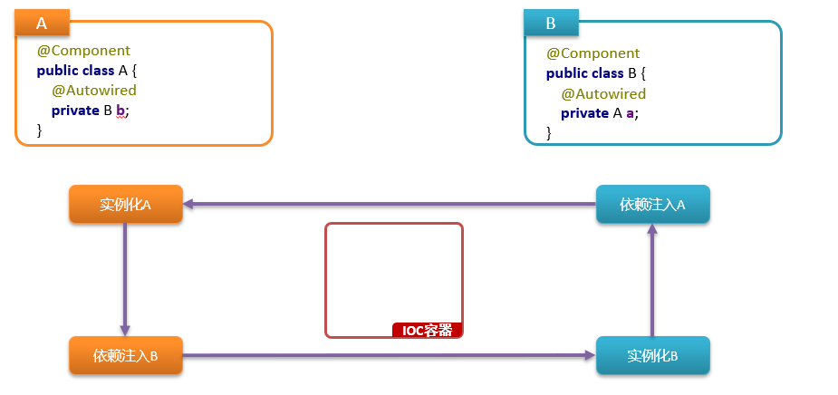
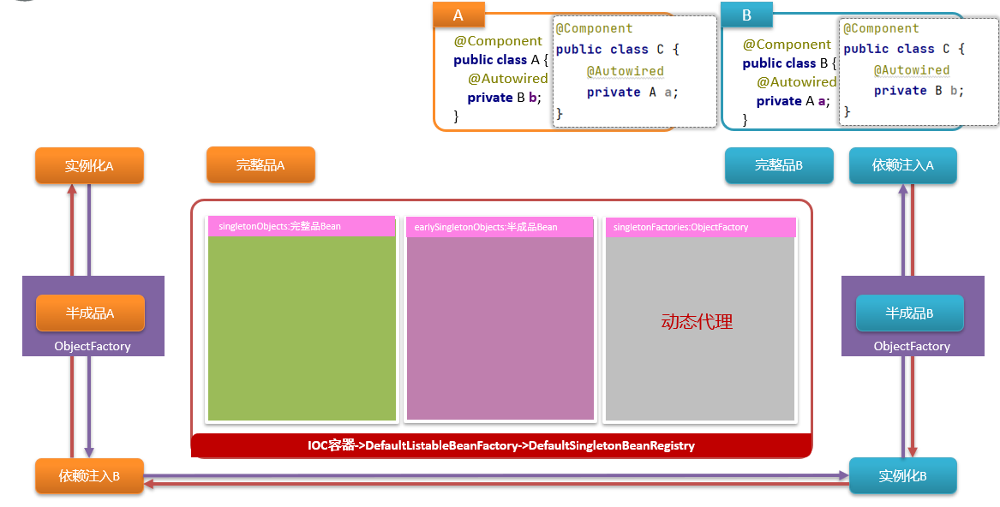
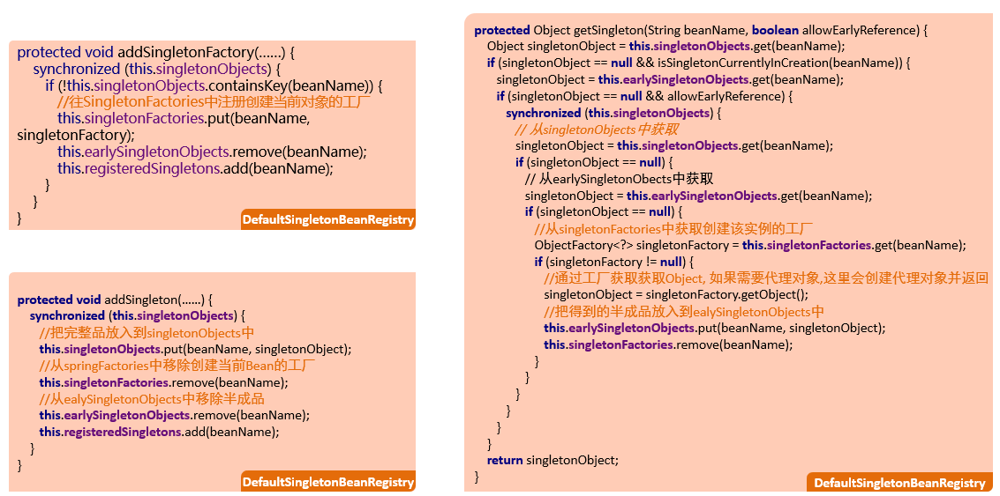

## Bean循环依赖

- 循环依赖指的是依赖闭环的问题

问：请聊一聊Spring中Bean的循环依赖? 

总: Bean的循环依赖指的是A依赖B，B又依赖A这样的依赖闭环问题，在Spring中，通过三个对象缓存区来解决循环依赖问题，这三个缓存区被定义到了DefaultSingletonBeanRegistry中，分别是singletonObjects用来存储创建完毕的Bean，earlySingletonObjecs用来存储未完成依赖注入的Bean，还有SingletonFactories用来存储创建Bean的ObjectFactory。假如说现在A依赖B，B依赖A，整个Bean的创建过程是这样的
分：
         首先，调用A的构造方法实例化A，当前的A还没有处理依赖注入，暂且把它称为半成品，此时会把半成品A封装到一个ObjectFactory中，并存储到springFactories缓存区
         接下来，要处理A的依赖注入了，由于此时还没有B，所以得先实例化一个B，同样的，半成品B也会被封装到ObjectFactory中，并存储到springFactory缓存区
         紧接着，要处理B的依赖注入了，此时会找到springFactories中A对应的ObjecFactory, 调用它的getObject方法得到刚才实例化的半成品A(如果需要代理对象,则会自动创建代理对象,将来得到的就是代理对象)，把得到的半成品A注入给B，并同时会把半成品A存入到earlySingletonObjects中，将来如果还有其他的类循环依赖了A，就可以直接从earlySingletonObjects中找到它了，那么此时springFactories中创建A的ObjectFactory也可以删除了
         至此，B的依赖注入处理完了后，B就创建完毕了，就可以把B的对象存入到singletonObjects中了，并同时删除掉springFactories中创建B的ObjectFactory
          B创建完毕后，就可以继续处理A的依赖注入了，把B注入给A，此时A也创建完毕了，就可以把A的对象存储到singletonObjects中，并同时删除掉earlySingletonObjects中的半成品A
          截此为止，A和B对象全部创建完毕，并存储到了singletonObjects中，将来通过容器获取对象，都是从singletonObejcts中获取
总：总结起来还是一句话，借助于DefaultSingletonBeanRegistry的三个缓存区可以解决循环依赖问题
