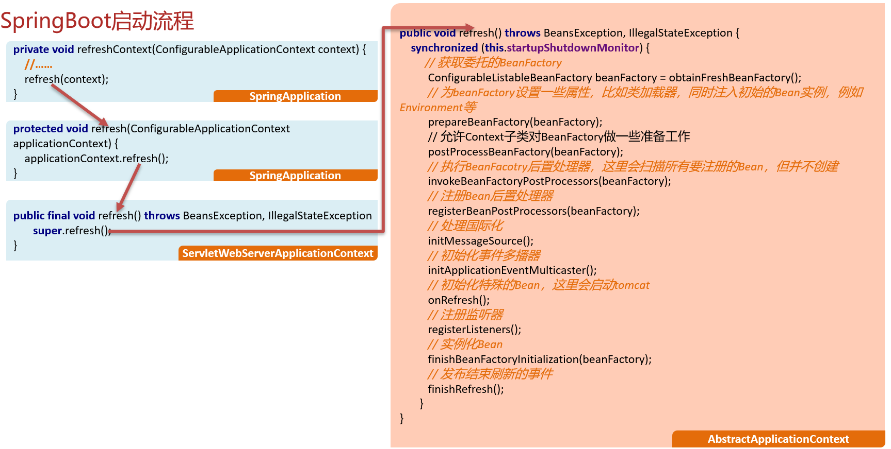

## IOC容器的初始化流程

- AbstractApplicationContext.refresh（）
  1. 准备BeanFactory（DefaultListableBeanFactory）
   设置ClassLoader
      设置Environment
  2. 扫描要放入容器中的Bean，得到对应的BeaDefinition(只扫描，并不创建)
  3. 注册BeanPostProcessor
  4. 处理国际化
  5. 初始化事件多播器ApplicationEventMulticaster
  6. 启动tomcat
  7. 绑定事件监听器和事件多播器
  8. 实例化非懒加载的单例Bean
  9. 扫尾工作，比如清空实例化时占用的缓存等

问：请聊一聊IOC容器的初始化流程? 

总: IOC容器的初始化，核心工作是在AbstractApplicationContext.refresh方法中完成的
分：在refresh方法中主要做了这么几件事         1. 准备BeanFactory，在这一块需要给BeanFacory设置很多属性，比如类加载器、Environment等
         2.  执行BeanFactory后置处理器，这一阶段会扫描要放入到容器中的Bean信息，得到对应的BeanDefinition（注意，这里只扫描，不创建）
         3.  是注册BeanPostProcesor，我们自定义的BeanPostProcessor就是在这一个阶段被加载的, 将来Bean对象实例化好后需要用到
         4.  启动tomcat
         5.  实例化容器中实例化非懒加载的单例Bean, 这里需要说的是，多例Bean和懒加载的Bean不会在这个阶段实例化，将来用到的时候再创建
          6.  当容器初始化完毕后，再做一些扫尾工作，比如清除缓存等		
总：简单总结一下，在IOC容器初始化的的过程中，首先得准备并执行BeanFactory后置处理器，其次得注册Bean后置处理器,并启动tomcat，最后需要借助于BeanFactory完成Bean的实例化
