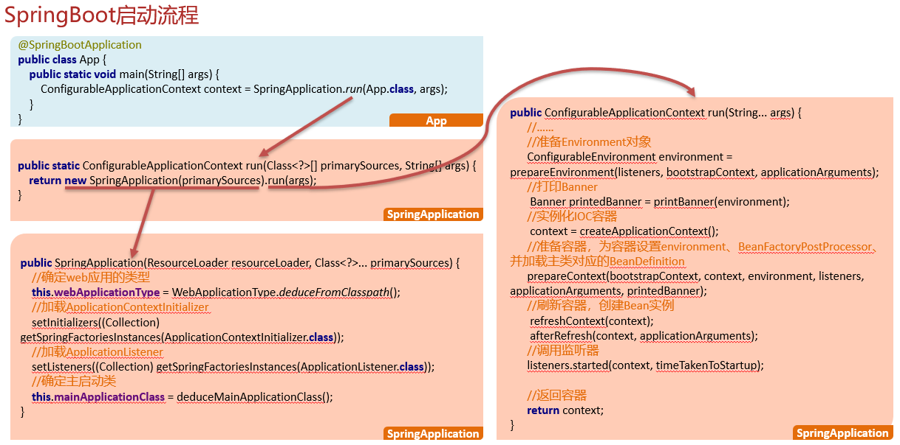

## SpringBoot启动流程

```markdown
1. 使用debug的方式看源码
```


### 启动流程

- new SpringApplication()
  1. 确认web应用的类型
  2. 加载ApplicationContextInitializer
  3. 加载ApplicationListener
  4. 记录主启动类

- run()

  1. 准备环境对象Environment,用于加载系统属性等等
  2. 打印Banner
  3. 实例化容器Context
  4. 准备容器,为容器设置Environment、BeanFactoryPostProcessor，并加载主类对应的BeanDefinition
  5. 刷新容器(创建Bean实例)
  6. 返回容器



### 面试回答参考

总: SpringBoot启动，其本质就是加载各种配置信息，然后初始化IOC容器并返回
分：在其启动的过程中会做这么几个事情
    首先，当我们在启动类执行SpringApplication.run这行代码的时候，在它的方法内部其实会做两个事情
	1. 创建SpringApplication对象；
	2. 执行run方法。
          其次，在创建SpringApplication对象的时候，在它的构造方法内部主要做3个事情。
	1. 确认web应用类型，一般情况下是Servlet类型，这种类型的应用，将来会自动启动一个tomcat
	2. 从spring.factories配置文件中，加载默认的ApplicationContextInitializer和ApplicationListener
	3. 记录当前应用的主启动类，将来做包扫描使用
    最后，对象创建好了以后，再调用该对象的run方法，在run方法的内部主要做4个事情
	1. 准备Environment对象，它里面会封装一些当前应用运行环境的参数，比如环境变量等等
	2. 实例化容器，这里仅仅是创建ApplicationContext对象
	3. 容器创建好了以后，会为容器做一些准备工作，比如为容器设置Environment、BeanFactoryPostProcessor后置处理器，并且加载主类对应的Definition
	4. 刷新容器，就是我们常说的referesh，在这里会真正的创建Bean实例
	总：总结一下我刚说的，其实SpringBoot启动的时候核心就两步，创建SpringApplication对象以及run方法的调用，在run方法中会真正的实例化容器，并创建容器中需要的Bean实例，最终返回
