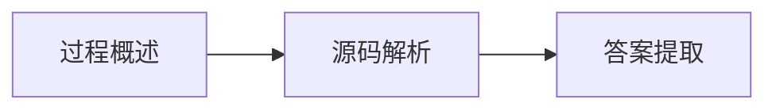

# 前置知识

1. [ApplicationContextInitializer](./docs/interview-konwledge/ApplicationContextInitializer.md)
2. [ApplicationListener](./docs/interview-konwledge/ApplicationListener.md)
3. [BeanFactory](./docs/interview-konwledge/BeanFactory.md)
4. [BeanDefinition](./docs/interview-konwledge/BeanDefinition.md)
5. [BeanFactoryPostProcessor](./docs/interview-konwledge/BeanFactoryPostProcessor.md)
6. [Aware](./docs/interview-konwledge/Aware.md)
7. [InitializingBean/DisposableBean](./docs/interview-konwledge/InitializingBean/DisposableBean.md)
8. [BeanPostProcessor](./docs/interview-konwledge/BeanPostProcessor.md)

# 面试题

1. [SpringBoot启动流程](./docs/interview-question/SpringBoot启动流程)
2. IOC容器初始化流程
3. Bean生命周期
4. Bean循环依赖
5. SpingMVC执行流程

