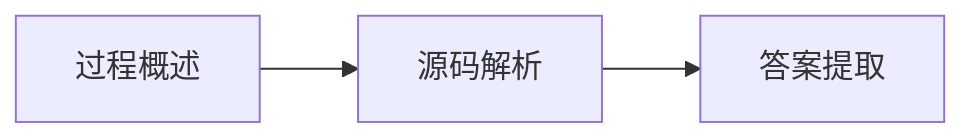

# 前置知识

1. [ApplicationContextInitializer](/docs/ApplicationContextInitializer.md)
2. ApplicationListener
3. BeanFactory
4. BeanDefinition
5. BeanFactoryPostProcessor
6. Aware
7. InitializingBean/DisposableBean
8. BeanPostProcessor

# 面试题

1. SpringBoot启动流程
2. IOC容器初始化流程
3. Bean生命周期
4. Bean循环依赖
5. SpingMVC执行流程

